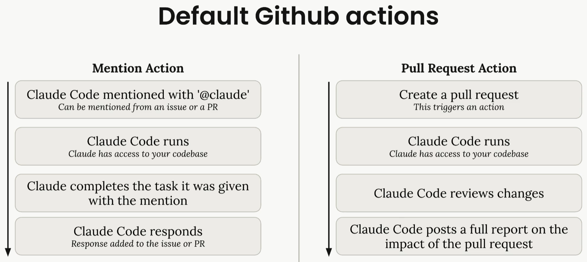

https://anthropic.skilljar.com/claude-code-in-action

npm run dev
On voit la port localhost:3000
C'est très lent


## MCP playright
Sous windows ce qui est précisé ne fonctionne pas

```powershell
claude mcp remove playwright
claude mcp add --transport stdio playwright -- cmd /c npx @playwright/mcp@latest
```

Voir `.claude\settings.local.json`
```json
{
    "permissions": {
        "allow": [
            "Bash(npm test:*)",
            "Bash(npm run lint:*)",
            "mcp__playwright"
        ]
    }
}
```

Voir : `src\lib\prompts\generation.tsx`


## GitHub Integration
* Faut mettre le projet dans un repo sur GitHub
* Faut installer https://github.com/apps/claude
    * Choisir uniquement le projet claude_code_in_action
    * On verra plus tard pour autoriser un autre dossier
* Installer dans claude code
```text
/install-github-app
```
A la fin un PR est créé et il faut pas oublier le MERGER le PR

C'est ce PR qui fait qu'on peut
1. mentionner `@claude` sur ce repo dans un prochain PR ou issue
2. demarrer claude sur chaque PR => poster un rapport sur l'impact du PR (pas tout compris encore)


<div align="center">
<br/>
</div>

On peut customiser et ajouter des actions déclenchées sur d'autres type d'events
Customiser le mentioning feature par exemple
Suite à l'installation on vient de merger 2 action config files sur le repo
Donc il faut commencer par faire un pull pour ramener tout ça localement
`git pull origin main`

Ensuite on voit 2 action config files dans `.github/workflows/claude.yml`
* 1 pour le @mention
* l'autre la la revue des PR

On veut customiser la mention fonctionalité
On veut qu'il run le projet et utilise Playwright MCP Server pour accèder l'app dans le browser le tout dans une action GitHub

Dans job:claude:steps:
Ajouter
* Pas tout compris
* On lande la commande de setup
* on démarre le serveur de development


```yml

- name: Project Setup
        run: |
          npm run Setup
          npm run dev:daemon
```

Ensuite dans la section `Run Claude Code` ajouter. **ATTENTION À L'INDENTATION**

```yml

custom_instructions: |
  The project is already set up with all dependencies installed.
  The server is already running at localhost:3000. Logs from it
  are being written to logs.txt. If needed, you can query the
  db with the 'sqlite3' cli. If needed, use the mcp__playwright
  set of tools to launch a browser and interact with the app.
```

Juste en dessous on ajoute la config MCP. **ATTENTION À L'INDENTATION**

```yml
mcp_config: |
  {
    "mcpServers": {
      "playwright": {
        "command": "npx",
        "args": [
          "@playwright/mcp@latest",
          "--allowed-origins",
          "localhost:3000;cdn.tailwindcss.com;esm.sh"
        ]
      }
    }
  }
```

**ATTENTION** Comme on utilise claude dans une action faut spécifier toutes les permissions qu'on veut donner à claude

```yml
allowed_tools: "Bash(npm:*),Bash(sqlite3:*),mcp__playwright__browser_snapshot mcp__playwright__browser_click"

```


Best practices:
* Start with the default workflows and customize gradually
* Use custom instructions to provide project-specific context
* Be explicit about tool permissions when using MCP servers
* Test your workflows with simple tasks before complex ones
* Consider your project's specific needs when configuring additional steps

Ensuite
```powershell

git add .
git commit -m "update workflow action"
git push origin main
```

On test ensuite en donnant une tache à claude
Prendre un screen shot des 2 boutons
On va sur le repo du projet sur GitHub
Coller l'image
Ajouter un text sans oublier de mentioner @claude

```text
Sometimes it feels like the buttons are not working as expected
Here are the ones I'm talking about:


@claude can you take a look at this? Just test them out and verify that clicking them toggles betwene the code and the previous tabs

```

Créer et attendre un peu